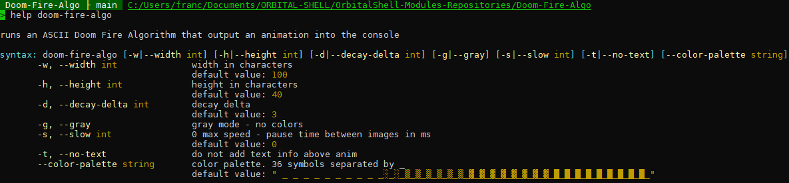

# Doom Fire Algorithm
Module for Orbital Shell

A simple module for orbital shell that add a command running the famous doom fire algorithm (C# ANSI version).


Doom is a first-person shooter video game series developed by id Software. The first title in the series, Doom, was released as shareware on PC in December 1993, that changed the world forever. The series is considered to have popularized the first-person shooter genre thanks in particular to its graphics, its game system, its unprecedented multiplayer mode and its economic model (shareware distribution) but also thanks to the controversies over violence. of the video games he started. Doom has thus strongly influenced the video game industry, its game system having been used in many titles long qualified as "Doom-like". The three episodes of the series have generally been well received by the trade press and have achieved significant commercial success, helping to make id Software a major player in the video game industry. The shareware version of Doom has been downloaded over thirty million times, with the first two games each selling over one million copies. For its part, Doom 3 has sold more than 3.5 million copies.

[](https://github.com/franck-gaspoz/Doom-Fire-Algo/actions/workflows/dotnet.yml)

 
 
<br>


<br>


<br>
[](license)

<br>

[](https://www.nuget.org/packages/OrbitalShell-Module-DoomFireAlgo) 

### Usage

install into the shell:
```shell
> module -i orbitalshell-module-doomfirealgo
```
run the command:
```shell
> doom-fire-algo
# or
> games-doom-fire-algo
```
<br>

play with parameters:

<br>



### Preview

```shell
> doom-fire-algo -h 35 -w 100 -s 20
```


<br>*a debug view from visual studio debuger (conhost)*

<br>

**based on the work of [Aldrie](https://github.com/Aldrie)** found in the doom fires repo @ https://github.com/filipedeschamps/doom-fire-algorithm/tree/master/playground/doom-fire-algorithm-ascii-art Thanks very much to him to have shared his work!


<br>preview of ASCII art javascript version from https://github.com/filipedeschamps/doom-fire-algorithm/tree/master/playground/doom-fire-algorithm-ascii-art

### Settings

*no settings*

<br><br><br><hr><br>

<b>Orbital Shell</b> is a multi-plateform (**windows, linux, macos, arm**) command shell, inspired by <b><i>bash</i></b> and POSIX recommendations. It provides any usual bash shell feature (even if modernized) and nice syntaxes and features allowing to interact (get/set/call members) with C# objects. Developed using **C# 8, .NET Core 3.1/Net 5 and .NET Standard 2.1**

